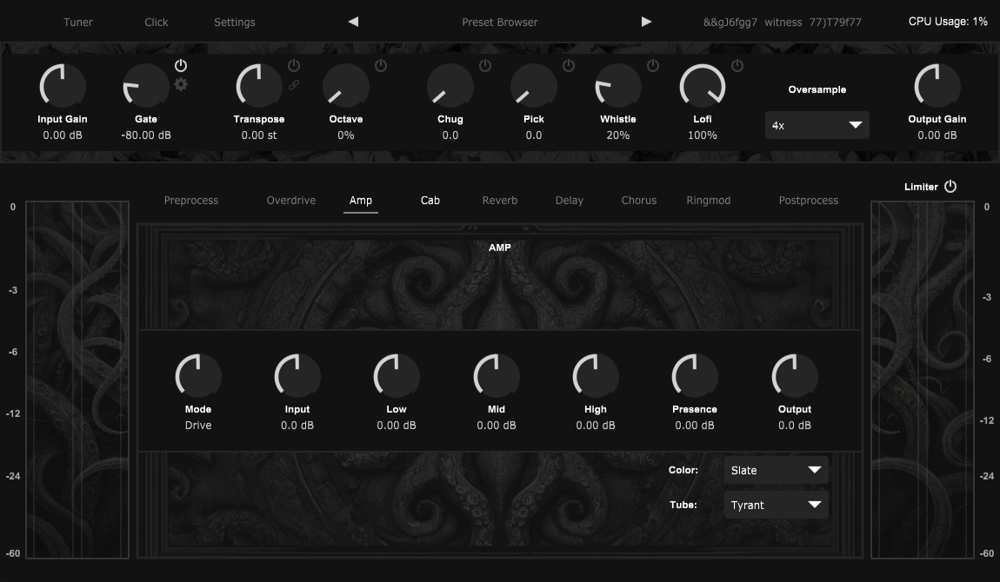

# Altar

Altar is a free, open-source guitar amplifier. 



Built with HISE: https://hise.dev/  

https://github.com/christophhart/HISE

### Modifications to HISE Source Code

Altar depends on several small fixes to the HISE source. I recommend using my fork:

https://github.com/nytemairqt/HISE

### Dependencies

Altar uses multiple HISE ThirdParty nodes with their own dependencies. They are included in the /DspNetworks/ThirdParty/src/dependencies folder and are (should be) compatible with GPL-3:

JSON: https://github.com/nlohmann/json/  
math_approx: https://github.com/Chowdhury-DSP/math_approx  
RTNeural: https://github.com/jatinchowdhury18/RTNeural  
RTNeural-NAM: https://github.com/jatinchowdhury18/RTNeural-NAM  
Rubberband (0.3b & below): https://github.com/breakfastquay/rubberband
signalsmith-stretch (0.4b & above): https://github.com/Signalsmith-Audio/signalsmith-stretch
xsimd: https://github.com/xtensor-stack/xsimd  

Read [DEPENDENCIES](./DspNetworks/ThirdParty/src/dependencies/DEPENDENCIES.md) for more information.

### Windows

TBA

### MacOS

Built and tested with macOS Monterey 12.6.1.

#### Install XCode

Latest versions of XCode will likely cause problems when compiling HISE. 

I used 13.2, available here:

`https://xcodereleases.com`

You might need to use a later version depending on your version of macOS.

#### Clone & Setup HISE 

Use my fork, which includes a template patch to fix an SIMD related error.

`git clone https://github.com/nytemairqt/HISE.git`

Extract the SDK:

`HISE/tools/SDK/sdk.zip`

The ASIOSDK2.3 and VST3 SDK folders need to be in the SDK folder, NOT the auto-generated "sdk" folder created by unzipping:

```
HISE/tools/SDK/ASIOSDK2.3
HISE/tools/SD/VST3 SDK
```

#### Update Projucer File

Now open the Projucer `HISE/tools/projucer/projucer` and drag the HISE Jucer file:

`HISE/projects/standalone/HISE Standalone.jucer` inside the Projucer.

#### Save & Build HISE

Click "Save & Open In IDE"

Once XCode launches, click Product -> Scheme -> Edit Scheme.

Under Build Configuration, select "Release".

Product -> Clean Build Folder
Product -> Build

#### Clone Altar, Compile ThirdParty Nodes

`git clone https://github.com/nytemairqt/altar.git`

Start HISE, `File -> Load Project -> Altar Root Folder`

DON'T OPEN THE XML. Instead, compile the ThirdParty Nodes:

`Export -> Compile DSP networks as dll`

#### Open Altar Project for Exporting Plugin

Open HISE again, this time you can open the Altar.xml.

`Export -> Export as FX plugin`

This will create a Binaries subfolder, and attempt to compile the plugin:

`Altar/Binaries/`

### Linux

These are the modified instructions from David Healey's Bootcamp Cheat Sheet. I highly recommend signing up for the bootcamp:

https://audiodevschool.com/courses/hise-bootcamp/

Assuming a fresh install (I used Linux Mint 21):

#### Install prerequisites
```bash
sudo apt update
```

```bash
sudo apt-get -y install \
  build-essential \
  git \
  make \
  mold \
  binutils-gold \
  libfreetype6-dev \
  libx11-dev \
  libxinerama-dev \
  libxrandr-dev \
  libxcursor-dev \
  mesa-common-dev \
  libasound2-dev \
  freeglut3-dev \
  libxcomposite-dev \
  libcurl4-gnutls-dev \
  libgtk-3-dev \
  libjack-jackd2-dev \
  libwebkit2gtk-4.1-dev \
  libfftw3-dev
```

#### Alias Mold Linker & Setup FFTW

Edit bashrc:
`nano ~/.bashrc`

```
# Add these lines at the end:

# mold linker alias
alias gold="mold"

# fftw3
export FFTWROOT=/usr/lib/x86_64-linux-gnu
export CPATH=$FFTWROOT/include:$CPATH
export LIBRARY_PATH=$FFTWROOT/lib:$LIBRARY_PATH
export LD_LIBRARY_PATH=$FFTWROOT/lib:$LD_LIBRARY_PATH
```

Apply & verify changes:

`source ~/.bashrc`

`gold --version` (should say mold)

#### Install Source Code Pro Font

Download: https://fonts.google.com/specimen/Source+Code+Pro
Extract to: `~/.fonts/SourceCodePro`
Move fonts from `static/` subfolder to the top-level folder.

#### Clone & Setup HISE

Use my fork, which includes several minor fixes to resolve annoying gcc errors.

`git clone https://github.com/nytemairqt/HISE.git`

Extract the SDK:

`HISE/tools/SDK/sdk.zip`

The ASIOSDK2.3 and VST3 SDK folders need to be in the SDK folder, NOT the auto-generated "sdk" folder created by unzipping:

```
HISE/tools/SDK/ASIOSDK2.3
HISE/tools/SD/VST3 SDK
```

#### Update Projucer File

Now open the Projucer `HISE/tools/projucer/projucer` and drag the HISE Jucer file:

`HISE/projects/standalone/HISE Standalone.jucer` inside the Projucer.

#### Enable FFTW3: 

Add to Extra Preprocessor Definitions:

```
AUDIOFFT_FFTW3=1
HI_ENABLE_CUSTOM_NODES=1
```

Add to Extra Linker Flags:

`-lfftw3f`

Enable in modules -> juce_dsp:

`JUCE_DSP_USE_STATIC_FFTW`

#### Save & Build HISE

Save Projucer project (File -> Save)

```
cd projects/standalone/Builds/LinuxMakefile
make clean
make CONFIG=Release -j 4
```

#### Fix Compiler Settings

Ctrl + H to view Hidden Files.

`~/.config/HISE/compilerSettings.xml`

Add the HISE Root folder to the HisePath variable.

Then copy the entire file to:

`~/.hise/compilerSettings.xml`

#### Open Altar Project for Compiling ThirdParty Nodes

Start HISE, `File -> Load Project -> Altar Root Folder`

DON'T OPEN THE XML. Instead, compile the ThirdParty Nodes:

`Export -> Compile DSP networks as dll`

This will generate: 

`Altar/DspNetworks/Binaries/`

Run `./batchCompileLinux.sh` to compile the ThirdParty Nodes.

#### Open Altar Project for Exporting Plugin

Open HISE again, this time you can open the Altar.xml.

`Export -> Export as FX plugin`

This will create a Binaries subfolder:

`Altar/Binaries/`

Open the directory, and run the `./batchCompileLinux.sh` script here to export the plugin. 

The final export is the ENTIRE Altar.vst3 folder.